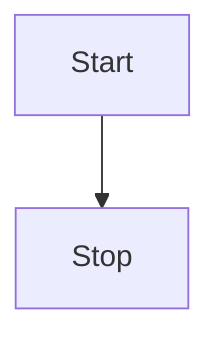
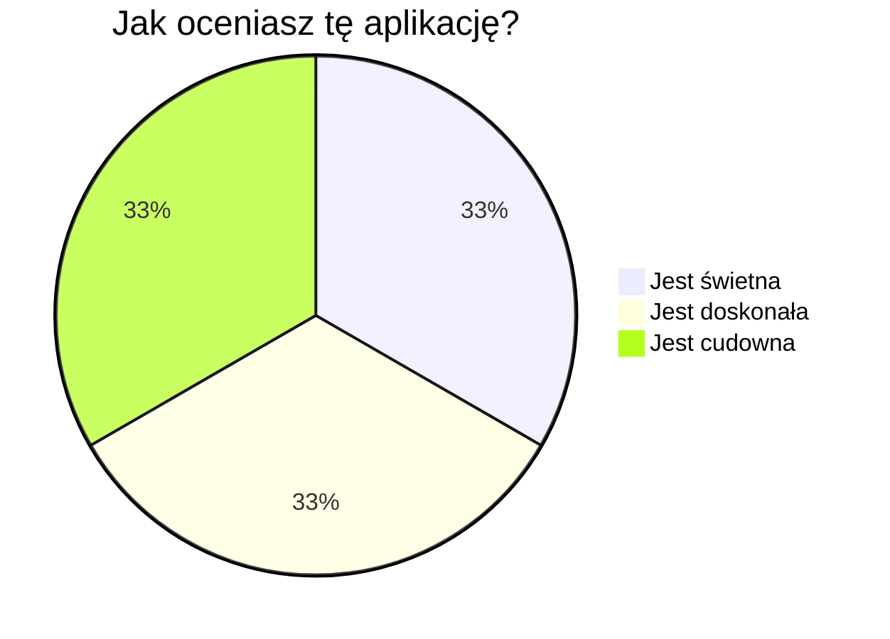

# Przykładowy artykuł
To przykładowy artykuł, który powinien pozwolić na zapoznanie się ze składnią markdowna.

## Wstęp
We wstępie zaprezentuję kilka podstawowych opcji formatowania tekstu. Należą do nich:
1. **Pogrubienie** tekstu
2. *Kursywa*
3. ~~Przekreślenie~~ tekstu

Jak widać powyżej, można w Markdownie zdefiniować listę numerowaną; można także wypunktowaną:
- pierwszy punkt
- drugi punkt

Aby podzielić dwie części tekstu na różne akapity, należy odseparować je pojedynczą pustą linią.

## Cytowanie tekstu
Aby zacytować tekst, używamy następującej konstrukcji:
> Cytat

## Wstawianie linków i obrazków

Tak wstawiamy [link](https://github.com)

A tak wstawiamy obrazek:


## Wstawianie tabeli

Autorzy aplikacji, posortowani alfabetycznie po nazwisku:
| Lp. | Imię  | Nazwisko |
| --- | --- | --- |
| 1. | Eryk | Andrzejewski |
| 2. | Konrad | Bankiewicz |
| 3. | Paweł | Błoch |
| 4. | Mateusz | Wysocki |

## Wstawianie bloku z kodem
Kod źródłowy można umieszczać na dwa sposoby:

`print('w linii')` - należy używać tego sposobu do krótkich kawałków kodu, gdyż nie jest on wtedy poprawnie kolorowany

```py
print('Albo w specjalnym bloczku')
```

## Inne opcje
Wcześniej przedstawiono podstawowe możliwości Markdowna. Jednak stosowana w tej aplikacji składnia jest znacznie bardziej rozbudowana i pozwala zagnieżdżać w treści także inne elementy:

### Lista TODO
- [ ] Ta funkcjonalność nie została jeszcze ukończona
- [X] Ta funkcjonalność została ukończona

### Wzory matematyczne
Można zagnieżdżać wzory matematyczne w linii, nawet takie banały jak to, że $2+2 = 4$ lub $\int_{1}^{+\infty} \frac{1}{x^2} = 2$. Można przy tym taki wzór inaczej sformatować w następujący sposób: $\displaystyle\int_{1}^{+\infty} \frac{1}{x^2} = 2$

Oczywiście możliwe jest także wstawianie takich wzorów w osobnej linii:
$$
\sum_{n=1}^{\infty} \frac{1}{n^2}
$$

### Diagramy
Możliwe jest wstawianie wielu różnych diagramów i wykresów. Poniżej kilka prostych przykładów:





## Edytor
Ze wszystkich zaprezentowanych tutaj funkcjonalności możesz skorzystać pisząc odpowiedni kod ręcznie, lub klikając odpowiedni przycisk w nagłówku edytora.

Dodatkowo, w prawym górnym rogu edytora znajdziesz kilka przełączników, na przykład włączenie i wyłączenie podglądu, albo przełączenie się w tryb pełnoekranowy. Warto się także zapoznać z zamieszczoną tam sekcją pomoc.

To wszystko, życzymy miłego korzystania z aplikacji! :smiley:
